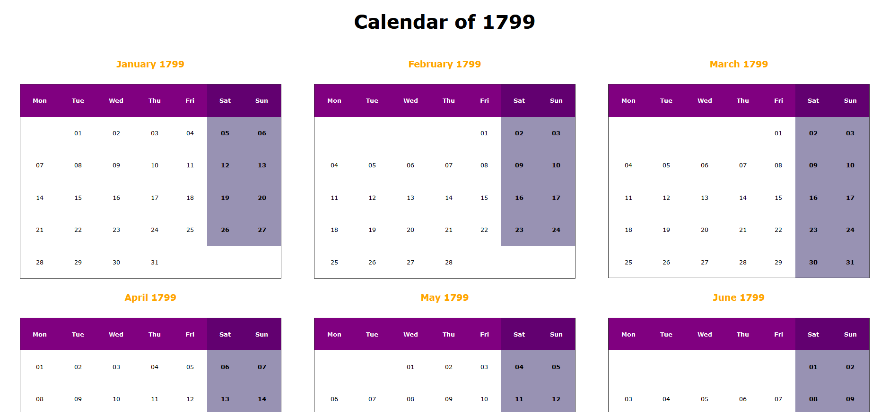

# Calendar Generator
This Python script generates a static calendar for the given year, year - 1 and year + 1.

## Usage
This is a command-line application. cd to th location of this script and
type:
`python calendar_generator.py -y <year> -o <output_file_name>`
For example:
`python calendar_generator.py -y 1800 -o Calendar_1800`

This will run the calendar generator script and will produce an html file
with the name 'Calendar_1800.html' in the directory named *Results* in the same
location as the script.

Below is the screenshot of the generated output.

Please note that
providing a year via the application generates calendar for the year - 1, year and year + 1.